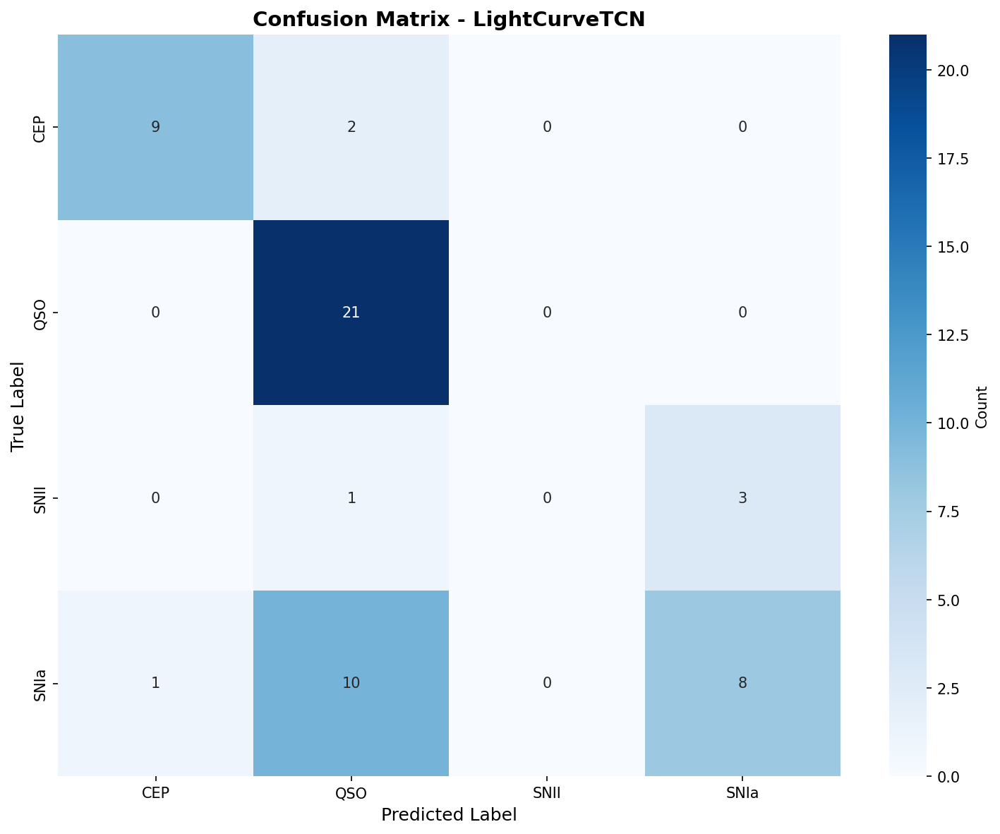
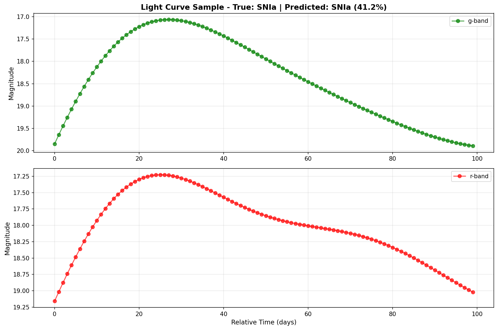
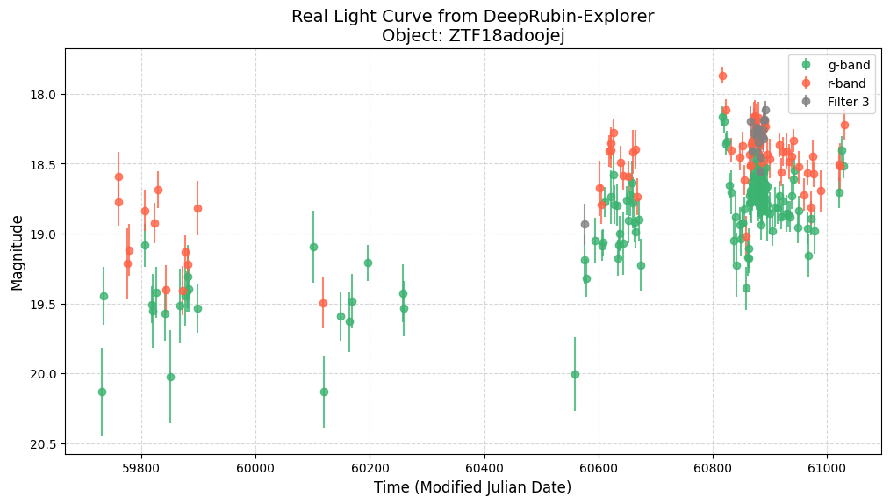

# DeepRubin-Explorer 🌌
### Real-time Transient Classification & Astrobiological Target Selection

[](https://opensource.org/licenses/MIT)
[](https://www.python.org/downloads/)
[](https://alerce.online/)

## 🔭 Overview
This repository implements a Machine Learning pipeline designed for the **Vera C. Rubin Observatory's LSST** era. The goal is to move beyond static batch processing by implementing real-time classification of astronomical transients (SNe, AGNs, Variables) using streaming data from the **ALeRCE broker**.

Inspired by recent research in multiscale astrobiology (e.g., Ćiprijanović et al.), this project explores how high-cadence photometry can be used to identify anomalous signals that may warrant follow-up observations.

## 📡 Scientific Motivation
How do we find life in a haystack of 10 million alerts per night? The **Vera C. Rubin Observatory (LSST)** will revolutionize our understanding of the dynamic universe, but its true power for astrobiology lies in **Anomaly Detection**. 

This project implements a high-performance Machine Learning pipeline to classify known astronomical transients (Supernovae, Variable Stars, AGNs). By mastering the "Expected Universe," we enable the identification of the **"Unexpected"**:
1. **Technosignature Candidates:** Signals that deviate from known physical models.
2. **Galactic Habitability:** Mapping high-energy events (SNe) that influence the chemical enrichment and sterilization risks of planetary systems.
3. **Interstellar Objects:** Identifying non-periodic transients that could be interstellar scouts or anomalous bolides.

## 🧠 ML Engineering Challenges
Transitioning from industrial ML to Astrophysics requires addressing domain-specific constraints:
* **Irregular Sampling:** Handling non-equidistant time series (cadence-dependent data).
* **Heteroscedastic Noise:** Integrating measurement uncertainties ($\sigma$) directly into the loss function.
* **Domain Shift:** Training on synthetic data (ELAsTiCC) and deploying on real survey streams (ZTF/Rubin).

## 🛠️ Architecture
The project is structured following clean code principles for scientific reproducibility:
* `ingestion/`: API wrappers for ALeRCE and ZTF alert streams.
* `preprocessing/`: Gaussian Process (GP) interpolation and feature extraction.
* `models/`: PyTorch implementations of Time-Series Transformers and RNNs.
* `notebooks/`: Exploratory Data Analysis (EDA) and astrophysical validation.

## 📊 Data Source
Currently utilizing the **Zwicky Transient Facility (ZTF)** alert stream via the **ALeRCE Client**, serving as a high-fidelity precursor to the upcoming LSST data release.

## 📈 Roadmap

- [x] **Data Ingestion:** Automated pipeline via ALeRCE API.
- [x] **Preprocessing:** Data cleaning and augmentation using Gaussian Processes (GP).
- [x] **Model Implementation:** Temporal Convolutional Network (TCN) with Dilated Convolutions for long-range temporal dependencies.
- [x] **Experiment Tracking:** MLflow integration for reproducibility and hyperparameter logging.
- [x] **Model Evaluation:** Performance report including Confusion Matrix and detailed classification metrics.
- [ ] **Exploratory Data Analysis (EDA):** Visual comparison of light curve classes and feature distributions.


---

## 🚀 How to Run

### 1. Environment Setup
Create and activate a Python virtual environment (requires Python 3.8-3.12):

```bash
python3.12 -m venv venv_pytorch
source venv_pytorch/bin/activate  # On macOS/Linux
pip install --upgrade pip
pip install -r requirements.txt
```

### 2. Data Ingestion
Download light curves from the ALeRCE broker:

```bash
python src/ingestion.py
```

This will download balanced samples of SNIa, SNII, QSO, and CEP classes into `data/`.

### 3. Preprocessing with Gaussian Processes
Apply GP interpolation to handle irregular sampling:

```bash
cd notebooks
jupyter notebook 02_preprocessing_gp.ipynb
```

Alternatively, run the preprocessing script if available.

### 4. Build PyTorch Dataset
Convert preprocessed light curves into tensors:

```bash
python src/build_tensor.py
```

This generates `X_lightcurves.npy` and `y_labels.csv` in `data/processed/`.

### 5. Train the Model
Train the Temporal Convolutional Network:

```bash
python src/train.py
```

Training metrics will be logged to MLflow. The model weights are saved in `models/rubin_tcn_model.pth`.

### 6. Evaluate the Model
Generate confusion matrix and classification report:

```bash
# Interactive mode (displays plots)
python src/evaluate.py

# Save all plots to disk
python src/evaluate.py --save-plots

# Save to custom directory
python src/evaluate.py --save-plots --output-dir results/experiment_01
```

### 7. View Experiment Results
Launch the MLflow UI to compare runs:

```bash
mlflow ui
```

Navigate to `http://127.0.0.1:5000` in your browser.

---

## Experiment Tracking with MLflow

### What is MLflow?
This project uses **MLflow** as an experiment tracking system. MLflow automatically logs each training run, including:
- **Hyperparameters:** Learning rate, batch size, number of epochs, model architecture.
- **Performance Metrics:** Accuracy and Loss (training and validation) logged per epoch.
- **Artifacts:** Saved versions of trained models (.pth) and used datasets.
- **Dataset Metadata:** File paths, number of samples, class distribution.

This functionality allows comparing different configurations, reproducing experiments, and auditing which data version generated each model.

### How to Launch the MLflow Interface
After running the training script (`src/train.py`), launch the MLflow web interface from the project root:

```bash
mlflow ui
```

### How to Visualize Experiments
Open your browser and navigate to:

```
http://127.0.0.1:5000
```

### What You Will Find in the Interface
- **Runs:** List of all training executions with their parameters and unique IDs.
- **Experiment Comparison:** Side-by-side visualization of metrics (Loss/Accuracy) between different runs.
- **Evolution Plots:** Automatic plotting of learning curves (train_loss, val_loss, val_acc vs. epoch).
- **Artifacts:** Direct download of the trained model (.pth) and the full serialized PyTorch model.
- **Data:** Information about the dataset used in each run, including paths and statistics.

---

## Results & Discussion

### Model Performance and Astrophysical Interpretation
The model achieved a peak validation accuracy of 67.3%. However, the global accuracy does not tell the full story. By analyzing the Confusion Matrix, we can see how the architecture interprets different physical processes.

<p align="center">
  
</p>

#### 1. Stochastic vs. Periodic Signals
**QSOs (Quasars):** The model achieved 100% precision. This is expected as the TCN (Temporal Convolutional Network) is excellent at identifying the stochastic variability (damped random walk patterns) typical of AGN, which differs significantly from the explosive nature of transients.

**CEPs (Cepheids):** High performance due to their periodic morphology. The dilated convolutions in the TCN successfully captured the repeating pulse shape.

#### 2. The Challenge of Supernovae (SN Ia vs. SN II)
The confusion matrix reveals a significant struggle in distinguishing between Supernova types:

**Class Imbalance:** Our dataset contains fewer SNe samples compared to QSOs.

**Morphological Similarity:** At early stages, the light curve rise for SN Ia and SN II can look nearly identical. Without a larger training set, the model tends to "default" to the more populated classes or confuse SN types with each other.

### Individual Inference Analysis
Looking at a specific prediction for a Type Ia Supernova:

<p align="center">
  
</p>

**GP Regression:** The Gaussian Process successfully smoothed the irregular cadence of the Rubin-like data, providing a clean input for the TCN.

**Confidence levels:** While the model correctly identified this sample as SN Ia, the confidence level (approx. 41%) indicates the neural network is aware of the ambiguity, likely due to the lack of distinctive "late-time" features in this specific 100-day window.

---

## �📈 Data Visualization

The project currently explores real-time astronomical transients. Below is an example of a **Type Ia Supernova (SNIa)** light curve (Object: **ZTF18adoojej**) retrieved from the ALeRCE broker. 



> **Scientific Note:** Notice the irregular gaps between observations and the characteristic brightness decay. These gaps represent the "missing data challenge" that we aim to solve using Gaussian Processes, as suggested by modern astrophysical deep learning research.

---

## 🎓 Conclusion

This project successfully demonstrates the implementation of a Temporal Convolutional Network for the classification of Rubin-LSST-like light curves. By leveraging Gaussian Processes for data augmentation and MLflow for experiment tracking, we established a robust pipeline for time-domain astronomy.

While the model excels at identifying stochastic and periodic sources (QSOs and Cepheids), the results highlight the critical importance of class balancing in transient astrophysics. This explorer serves as a foundation for future Bayesian deep learning approaches in the Rubin era.

---

**Author:** Giuliana Barbieri — *ML Engineer exploring the intersection of Big Data and Extragalactic Astrophysics.* 


