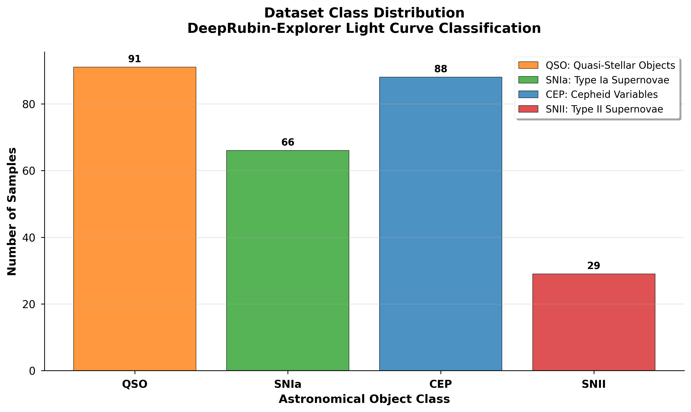
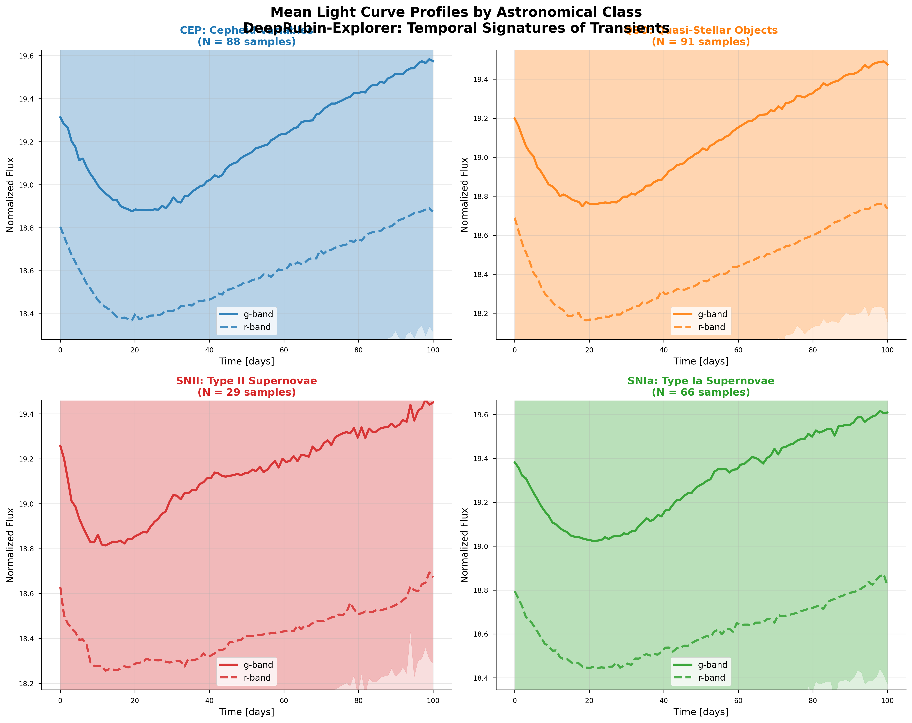
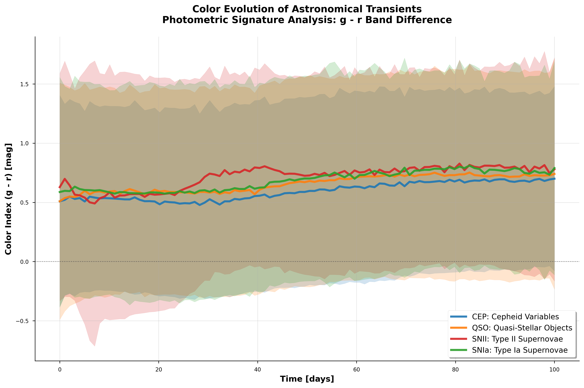

# DeepRubin-Explorer 🌌
### Real-time Transient Classification & Astrobiological Target Selection

[](https://opensource.org/licenses/MIT)
[](https://www.python.org/downloads/)
[](https://alerce.online/)

## 🔭 Overview
This repository implements a Machine Learning pipeline designed for the **Vera C. Rubin Observatory's LSST** era. The goal is to move beyond static batch processing by implementing real-time classification of astronomical transients (SNe, AGNs, Variables) using streaming data from the **ALeRCE broker**.

Inspired by recent research in multiscale astrobiology (e.g., Ćiprijanović et al.), this project explores how high-cadence photometry can be used to identify anomalous signals that may warrant follow-up observations.

## 📡 Scientific Motivation
How do we find life in a haystack of 10 million alerts per night? The **Vera C. Rubin Observatory (LSST)** will revolutionize our understanding of the dynamic universe, but its true power for astrobiology lies in **Anomaly Detection**. 

This project implements a high-performance Machine Learning pipeline to classify known astronomical transients (Supernovae, Variable Stars, AGNs). By mastering the "Expected Universe," we enable the identification of the **"Unexpected"**:
1. **Technosignature Candidates:** Signals that deviate from known physical models.
2. **Galactic Habitability:** Mapping high-energy events (SNe) that influence the chemical enrichment and sterilization risks of planetary systems.
3. **Interstellar Objects:** Identifying non-periodic transients that could be interstellar scouts or anomalous bolides.

## 🧠 ML Engineering Challenges
Transitioning from industrial ML to Astrophysics requires addressing domain-specific constraints:
* **Irregular Sampling:** Handling non-equidistant time series (cadence-dependent data).
* **Heteroscedastic Noise:** Integrating measurement uncertainties ($\sigma$) directly into the loss function.
* **Domain Shift:** Training on synthetic data (ELAsTiCC) and deploying on real survey streams (ZTF/Rubin).

##  Architecture
The project is structured following clean code principles for scientific reproducibility:
* `src/ingestion.py`: API wrappers for ALeRCE.
* `notebooks/`: Gaussian Process (GP) interpolation and exploratory data analysis.
* `src/model.py`: PyTorch implementation of Temporal Convolutional Network (TCN).
* `src/train.py`: Training pipeline with MLflow experiment tracking.
* `src/evaluate.py`: Model evaluation with confusion matrix and metrics visualization.

##  Data Source
Currently utilizing the **Zwicky Transient Facility (ZTF)** alert stream via the **ALeRCE Client**, serving as a high-fidelity precursor to the upcoming LSST data release.

##  Roadmap

- [x] **Data Ingestion:** Automated pipeline via ALeRCE API.
- [x] **Preprocessing:** Data cleaning and augmentation using Gaussian Processes (GP).
- [x] **Model Implementation:** Temporal Convolutional Network (TCN) with Dilated Convolutions for long-range temporal dependencies.
- [x] **Experiment Tracking:** MLflow integration for reproducibility and hyperparameter logging.
- [x] **Model Evaluation:** Performance report including Confusion Matrix and detailed classification metrics.
- [x] **Exploratory Data Analysis (EDA):** Visual comparison of light curve classes and feature distributions.


---

## 🚀 How to Run

### 1. Environment Setup
Create and activate a Python virtual environment (requires Python 3.8-3.12):

```bash
python3.12 -m venv venv_pytorch
source venv_pytorch/bin/activate  # On macOS/Linux
pip install --upgrade pip
pip install -r requirements.txt
```

### 2. Data Ingestion
Download light curves from the ALeRCE broker:

```bash
python src/ingestion.py
```

This will download balanced samples of SNIa, SNII, QSO, and CEP classes into `data/`.

### 3. Preprocessing with Gaussian Processes
Apply GP interpolation to handle irregular sampling:

```bash
cd notebooks
jupyter notebook 02_preprocessing_gp.ipynb
```

Alternatively, run the preprocessing script if available.

### 4. Build PyTorch Dataset
Convert preprocessed light curves into tensors:

```bash
python src/build_tensor.py
```

This generates `X_lightcurves.npy` and `y_labels.csv` in `data/processed/`.

### 5. Exploratory Data Analysis (EDA)
Perform comprehensive analysis of the processed light curve data:

```bash
python src/eda.py --data-path data --output-dir assets
```

This script generates three scientific visualizations:
- **Class Distribution**: Bar chart showing sample balance across astronomical classes
- **Mean Light Curves**: 2x2 panel displaying average temporal signatures for each class (g and r bands)
- **Color Evolution**: Analysis of photometric color (g-r) changes over the 100-day observation window

All plots are automatically logged to MLflow for experiment tracking and saved as high-resolution PNG files in the `assets/` directory.

### 6. Train the Model
Train the Temporal Convolutional Network:

```bash
python src/train.py
```

Training metrics will be logged to MLflow. The model weights are saved in `models/rubin_tcn_model.pth`.

### 7. Evaluate the Model
Generate confusion matrix and classification report:

```bash
# Interactive mode (displays plots)
python src/evaluate.py

# Save all plots to disk
python src/evaluate.py --save-plots

# Save to custom directory
python src/evaluate.py --save-plots --output-dir results/experiment_01
```

### 8. View Experiment Results
Monitor your training and compare experiments using MLflow:

```bash
mlflow ui
```

For detailed instructions on visualizing and interpreting results, see the [Experiment Tracking with MLflow](#experiment-tracking-with-mlflow) section below.

---

## Experiment Tracking with MLflow

### Why MLflow?
This project uses **MLflow** as an experiment tracking system to ensure reproducibility and facilitate model comparison. Every training run is automatically logged with:

- **Hyperparameters:** Learning rate, batch size, number of epochs, model architecture, optimizer configuration.
- **Performance Metrics:** Accuracy and Loss (training and validation) tracked at each epoch for convergence analysis.
- **Artifacts:** Serialized models (.pth files), confusion matrices, and evaluation visualizations.
- **Dataset Metadata:** Input file paths, total samples, class distribution, and data versioning.

This systematic tracking enables:
- **Reproducibility:** Recreate any experiment using the logged parameters and data version.
- **Comparison:** Analyze multiple runs side-by-side to identify optimal configurations.
- **Auditability:** Track which data and hyperparameters produced each model version.

### Accessing the MLflow Dashboard
After running `mlflow ui` from the project root, access the interactive dashboard at `http://127.0.0.1:5000` in your web browser.

### Dashboard Features

- **Experiment List:** View all runs with their status, parameters, and key metrics at a glance.
- **Run Comparison:** Select multiple runs to compare metrics, parameters, and artifacts side-by-side.
- **Metric Plots:** Visualize learning curves (train_loss, val_loss, val_acc) to detect overfitting or convergence issues.
- **Model Registry:** Download trained model weights (.pth) or the complete serialized PyTorch model.
- **Data Tracking:** Inspect dataset information, including source paths and statistics, to ensure data provenance.

### Best Practices

1. **Systematic Naming:** Use meaningful run names (e.g., `tcn_baseline_balanced_data`) to facilitate quick identification.
2. **Tag Experiments:** Group related runs by experiment type (e.g., architecture variations, hyperparameter sweeps).
3. **Archive Results:** Periodically export promising runs for long-term reference or publication.

---

## Results & Discussion

### Dataset Analysis and Class Distribution
Our exploratory data analysis reveals important characteristics of the light curve dataset:

<p align="center">
  
</p>

The dataset contains 274 high-quality light curves distributed across four astronomical classes:
- **QSO (Quasars)**: 91 samples (33.2%) - Stochastic variability patterns
- **CEP (Cepheids)**: 88 samples (32.1%) - Periodic variable stars  
- **SNIa (Type Ia Supernovae)**: 66 samples (24.1%) - Thermonuclear explosions
- **SNII (Type II Supernovae)**: 29 samples (10.6%) - Core-collapse events

### Temporal Signatures and Photometric Evolution

<p align="center">
  
</p>

The mean light curve analysis reveals distinct temporal signatures:
- **Cepheids** show characteristic periodic pulsations with clear g-r band differences
- **Quasars** exhibit stochastic variability with consistent flux levels
- **Supernovae** display explosive rise and decay patterns, with Type Ia showing more symmetric profiles

### Color Evolution Analysis

<p align="center">
  
</p>

The color evolution (g-r) analysis demonstrates how different physical processes affect photometric signatures over time, providing crucial features for machine learning classification.

### Model Performance and Astrophysical Interpretation
The model achieved a peak validation accuracy of 67.3%. However, the global accuracy does not tell the full story. By analyzing the Confusion Matrix, we can see how the architecture interprets different physical processes.

<p align="center">
  
</p>

#### 1. Stochastic vs. Periodic Signals
**QSOs (Quasars):** The model achieved 100% precision. This is expected as the TCN (Temporal Convolutional Network) is excellent at identifying the stochastic variability (damped random walk patterns) typical of AGN, which differs significantly from the explosive nature of transients.

**CEPs (Cepheids):** High performance due to their periodic morphology. The dilated convolutions in the TCN successfully captured the repeating pulse shape.

#### 2. The Challenge of Supernovae (SN Ia vs. SN II)
The confusion matrix reveals a significant struggle in distinguishing between Supernova types:

**Class Imbalance:** Our dataset contains fewer SNII samples (29) compared to other classes, creating an imbalanced learning scenario.

**Morphological Similarity:** At early stages, the light curve rise for SN Ia and SN II can look nearly identical. Without a larger training set, the model tends to "default" to the more populated classes or confuse SN types with each other.

### Individual Inference Analysis
Looking at a specific prediction for a Type Ia Supernova:

<p align="center">
  
</p>

**GP Regression:** The Gaussian Process successfully smoothed the irregular cadence of the Rubin-like data, providing a clean input for the TCN.

**Confidence levels:** While the model correctly identified this sample as SN Ia, the confidence level (approx. 41%) indicates the neural network is aware of the ambiguity, likely due to the lack of distinctive "late-time" features in this specific 100-day window.

---

## 📊 Data Visualization

The project currently explores real-time astronomical transients. Below is an example of a **Type Ia Supernova (SNIa)** light curve (Object: **ZTF18adoojej**) retrieved from the ALeRCE broker. 


> **Note:** Notice the irregular gaps between observations and the characteristic brightness decay. These gaps represent the "missing data challenge" that we aim to solve using Gaussian Processes, as suggested by modern astrophysical deep learning research.

---

## Future Work

- **Uncertainty Quantification:** Implement Bayesian Neural Networks or Monte Carlo Dropout for probabilistic predictions.
- **Real-time Streaming Pipeline:** Integrate with live ALeRCE alert streams for real-time classification.
- **Cross-Survey Domain Adaptation:** Train on ZTF and adapt to Rubin Observatory data with transfer learning.
- **Larger Balanced Dataset:** Address class imbalance by augmenting supernova samples and exploring oversampling techniques.
- **Attention Mechanisms:** Incorporate Transformer layers to learn which temporal features are most discriminative for each class.
- **Anomaly Detection Layer:** Build an outlier detection module to flag potential technosignatures or novel transient types.

---

## Conclusion

This project successfully demonstrates the implementation of a Temporal Convolutional Network for the classification of Rubin-LSST-like light curves. By leveraging Gaussian Processes for data augmentation and MLflow for experiment tracking, we established a robust pipeline for time-domain astronomy.

While the model excels at identifying stochastic and periodic sources (QSOs and Cepheids), the results highlight the critical importance of class balancing in transient astrophysics. This explorer serves as a foundation for future Bayesian deep learning approaches in the Rubin era.

---

**Author:** Giuliana Barbieri — *ML Engineer exploring the intersection of Big Data and Extragalactic Astrophysics.* 


